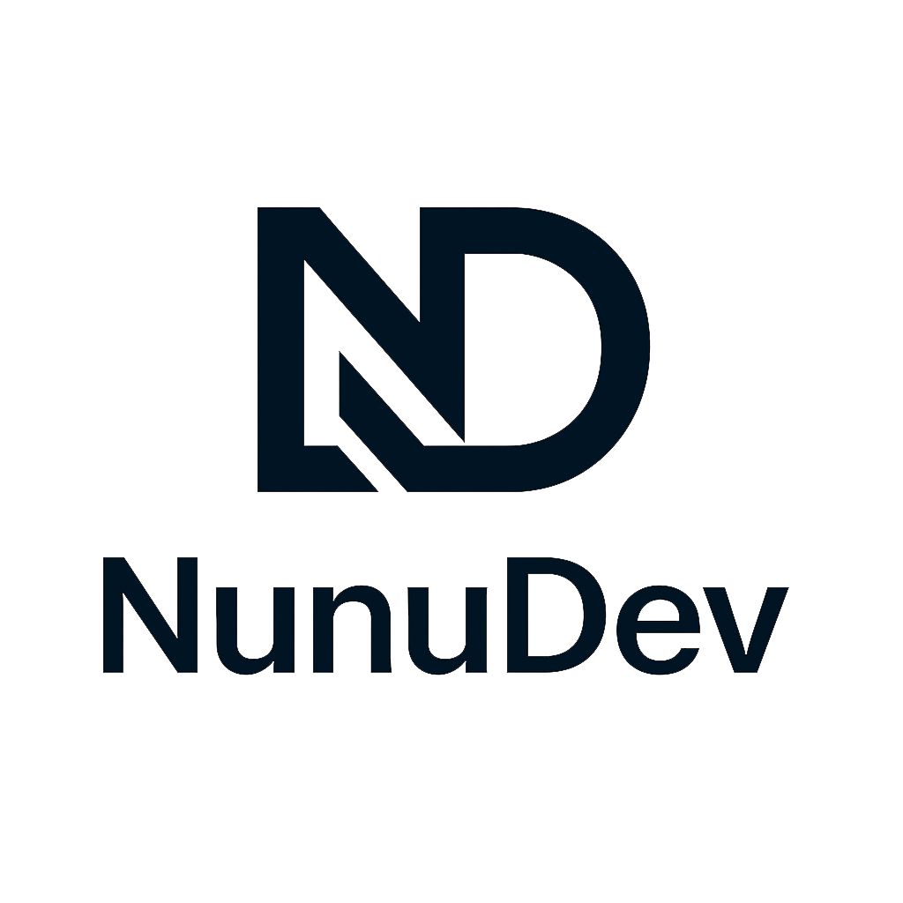

# 🚀 Portfolio Website - Wyandhanu Maulidan Nugraha

<div align="center">
  
  
  <h3>Personal Portfolio Website</h3>
  <p>Mahasiswa D3 Teknik Informatika | Web Developer | Game Developer</p>
  
  [](https://html.spec.whatwg.org/)
  [](https://www.w3.org/Style/CSS/)
  [](https://developer.mozilla.org/en-US/docs/Web/JavaScript)
  [](https://wa.me/6283870405395)
  
  [🌐 Live Demo](#) • [📧 Contact](mailto:wyandhanu.maulidan.tif24@polban.ac.id) • [💼 LinkedIn](https://linkedin.com/in/wyandhanu-maulidan-n-47762b32a)
</div>

---

## 📋 Daftar Isi

- [📖 Tentang](#-tentang)
- [✨ Fitur](#-fitur)
- [🛠️ Teknologi](#️-teknologi)
- [🚀 Instalasi](#-instalasi)
- [📁 Struktur Project](#-struktur-project)
- [💻 Penggunaan](#-penggunaan)
- [📱 Responsive Design](#-responsive-design)
- [🎨 Komponen](#-komponen)
- [🏆 Prestasi](#-prestasi)
- [📞 Kontak](#-kontak)
- [📄 Lisensi](#-lisensi)

## 📖 Tentang

Portfolio website personal yang menampilkan perjalanan akademik, profesional, dan prestasi saya sebagai mahasiswa D3 Teknik Informatika di Politeknik Negeri Bandung. Website ini dirancang dengan pendekatan modern, responsive, dan user-friendly untuk memberikan pengalaman terbaik bagi pengunjung.

### 🎯 Tujuan Website

- **Profesional Branding**: Membangun identitas digital sebagai web & game developer
- **Showcase Portfolio**: Menampilkan proyek-proyek dan karya yang telah dibuat
- **Networking**: Memudahkan koneksi dengan profesional dan peluang kolaborasi
- **Dokumentasi**: Mendokumentasikan perjalanan karir dan prestasi

## ✨ Fitur

### 🎨 Design & UI/UX
- ✅ **Modern & Clean Design** - Desain minimalis dengan sentuhan gradient modern
- ✅ **Accessibility Compliant** - Mengikuti standar aksesibilitas web

### 🔧 Fungsionalitas
- ✅ **Responsive Navigation** - Hamburger menu untuk mobile devices
- ✅ **Smooth Scrolling** - Navigasi halus antar section
- ✅ **Portfolio Filter** - Filter proyek berdasarkan kategori (Web/Game)
- ✅ **Back to Top Button** - Tombol kembali ke atas yang dinamis
- ✅ **Video Showcase** - Autoplay video untuk demonstrasi proyek
- ✅ **WhatsApp Integration** - Integrasi langsung dengan WhatsApp
- ✅ **Social Media Links** - Link ke berbagai platform sosial media

### 📱 Sections
1. **Hero Section** - Pengenalan dengan foto profil dan CTA buttons
2. **About** - Informasi personal dan profesional
3. **Education** - Timeline pendidikan dengan desain menarik
4. **Skills** - Visualisasi skill dengan progress bars dan tags
5. **Experience** - Pengalaman kerja, organisasi, dan prestasi
6. **Portfolio** - Showcase proyek dengan filter kategori
7. **Video Showcase** - Demonstrasi video project
8. **Gallery** - Galeri foto prestasi dan kegiatan
9. **Contact** - Form kontak dan informasi lengkap

## 🛠️ Teknologi

### Frontend
```javascript
const techStack = {
  markup: "HTML5",
  styling: "CSS3 (Custom Properties, Flexbox, Grid)",
  scripting: "Vanilla JavaScript ES6+",
  icons: "Font Awesome 6.0.0",
  optimization: "Lazy Loading, Minification"
};
```

### Design System
- **Color Palette**:
  - Primary: `#2563eb` (Blue)
  - Secondary: `#10b981` (Green)
  - Accent: `#f59e0b` (Orange)
  - Dark: `#1f2937`
  - Light: `#f9fafb`

- **Typography**: Segoe UI, System Fonts
- **Spacing**: 8px Grid System
- **Breakpoints**:
  - Mobile: < 480px
  - Tablet: < 768px
  - Desktop: > 768px

## 🚀 Instalasi

### Prerequisites
- Web browser modern (Chrome, Firefox, Safari, Edge)
- Text editor (VSCode recommended)
- Live Server extension (optional)

### Setup Lokal

1. **Clone Repository**
```bash
git clone https://github.com/nunu-dev/cv_wyandhanu.git
cd cv_wyandhanu
```

2. **Struktur File yang Diperlukan**
```
portfolio-website/
├── index.html
├── Logo.png
├── Test.JPG (foto profil)
├── README.md
└── assets/
    ├── images/
    │   ├── PTSGM.png
    │   ├── BBGAME.png
    │   ├── DJP.jpg
    │   ├── JTEDO.jpg
    │   ├── JDJP.jpg
    │   ├── SFLS2n.png
    │   ├── HAKI.png
    │   └── MPM.png
    └── videos/
        └── videoclip1.mp4
```

3. **Jalankan Website**
   - Buka `index.html` di browser, atau
   - Gunakan Live Server di VSCode
   - Atau jalankan dengan Python:
```bash
# Python 3
python -m http.server 8000

# Python 2
python -m SimpleHTTPServer 8000
```

## 📁 Struktur Project

```
portfolio-website/
│
├── 📄 index.html          # File utama website
├── 🖼️ Logo.png            # Logo NunuDev
├── 📷 Test.JPG            # Foto profil
├── 📝 README.md           # Dokumentasi project
│
├── 📁 assets/             # Asset folder
│   ├── 📁 images/         # Gambar portfolio & gallery
│   └── 📁 videos/         # Video showcase
│
└── 📁 docs/               # Dokumentasi tambahan (optional)
```

## 💻 Penggunaan

### Navigasi Website

```javascript
// Navigasi menggunakan menu
const menuItems = [
  { section: 'Home', id: '#home' },
  { section: 'Tentang', id: '#about' },
  { section: 'Pendidikan', id: '#education' },
  { section: 'Keterampilan', id: '#skills' },
  { section: 'Pengalaman', id: '#experience' },
  { section: 'Portfolio', id: '#portfolio' },
  { section: 'Video', id: '#video-showcase' },
  { section: 'Galeri', id: '#gallery' },
  { section: 'Kontak', id: '#contact' }
];
```

### Customization Guide

#### 1. Mengubah Informasi Personal
```html
<!-- Di Hero Section -->
<h1 class="hero-title">Your Name</h1>
<p class="hero-subtitle">Your Title</p>
```

#### 2. Menambah Project Portfolio
```html
<div class="portfolio-item" data-category="web">
    <div class="portfolio-image">
        
    </div>
    <div class="portfolio-info">
        <h4>Project Title</h4>
        <div class="tech-stack">
            <span class="tech-tag">Tech1</span>
        </div>
        <p>Project description</p>
    </div>
</div>
```

#### 3. Update Skills
```html
<div class="skill-item">
    <span class="skill-name">Skill Name</span>
    <div class="skill-bar">
        <div class="skill-progress" style="width: 80%"></div>
    </div>
</div>
```

## 📱 Responsive Design

### Breakpoint Strategy

| Device | Width | Features |
|--------|-------|----------|
| Mobile | < 480px | Hamburger menu, single column layout |
| Tablet | 481px - 768px | Adjusted grid, medium typography |
| Desktop | > 768px | Full navigation, multi-column grid |

### Mobile Optimizations
- Touch-friendly buttons (min 44x44px)
- Hamburger menu dengan overlay
- Optimized images untuk loading cepat
- Vertical timeline untuk education section

## 🎨 Komponen

### Custom Components

#### 1. Navigation Bar
- Fixed position dengan background blur effect
- Hamburger menu untuk mobile
- Active state indicator
- Smooth scroll behavior

#### 2. Timeline Component
```css
.timeline-item {
    background: white;
    padding: 25px;
    border-left: 4px solid var(--primary-color);
    box-shadow: var(--shadow);
}
```

#### 3. Skill Progress Bar
```javascript
// Animasi skill bar on scroll
const animateSkillBars = () => {
    const skillBars = document.querySelectorAll('.skill-progress');
    // Animation logic
};
```

#### 4. Portfolio Filter
```javascript
// Filter functionality
filterBtns.forEach(btn => {
    btn.addEventListener('click', function() {
        const filter = this.getAttribute('data-filter');
        // Filter logic
    });
});
```

## 🏆 Prestasi

### 🎮 Game Development
- **Juara II** - Lomba Cipta Game Edukasi Perpajakan (DJP)
- **Sertifikat Hak Cipta** - Kemenkumham RI

### 🥋 Taekwondo
- **Multiple Championships** - Level Nasional, Provinsi, dan Kota
- **International Invitation** - Bandung Taekwondo International

### 🎭 Seni & Budaya
- **Juara II** - Festival TTFK (Teater)
- **Nominasi Best Actor** - Festival TTFK
- **FLS2N** - Solo Gitar 2023

## 📞 Kontak

<div align="center">

### Mari Terhubung! 🤝

| Platform | Link | Username/Info |
|----------|------|---------------|
| 📧 Email | [Send Email](mailto:wyandhanu.maulidan.tif24@polban.ac.id) | wyandhanu.maulidan.tif24@polban.ac.id |
| 💬 WhatsApp | [Chat Now](https://wa.me/6283870405395) | +62 838-7040-5395 |
| 💼 LinkedIn | [Connect](https://linkedin.com/in/wyandhanu-maulidan-n-47762b32a) | Wyandhanu Maulidan N |
| 🐙 GitHub | [Follow](https://github.com/wyandhanupapoy) | @wyandhanupapoy |
| 📷 Instagram | [Follow](https://www.instagram.com/wyandhanumn_/) | @wyandhanumn_ |

</div>

## 🤝 Kontribusi

Saran dan feedback sangat diterima! Jika Anda memiliki ide untuk meningkatkan website ini:

1. Fork repository
2. Buat branch baru (`git checkout -b feature/AmazingFeature`)
3. Commit changes (`git commit -m 'Add some AmazingFeature'`)
4. Push ke branch (`git push origin feature/AmazingFeature`)
5. Buat Pull Request

## 📄 Lisensi

Copyright © 2025 **Wyandhanu Maulidan Nugraha**. All rights reserved.

Website ini adalah karya personal dan dilindungi hak cipta. Penggunaan kode untuk pembelajaran diperbolehkan dengan mencantumkan atribusi.

---

<div align="center">
  
### ⭐ Star Repository ini jika bermanfaat!

Made with ❤️ by **Wyandhanu Maulidan Nugraha**

[🔝 Back to Top](#-cv_wyandhanu---wyandhanu-maulidan-nugraha)

</div>